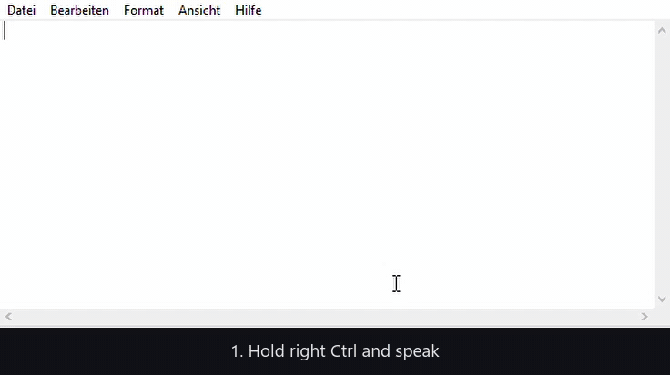
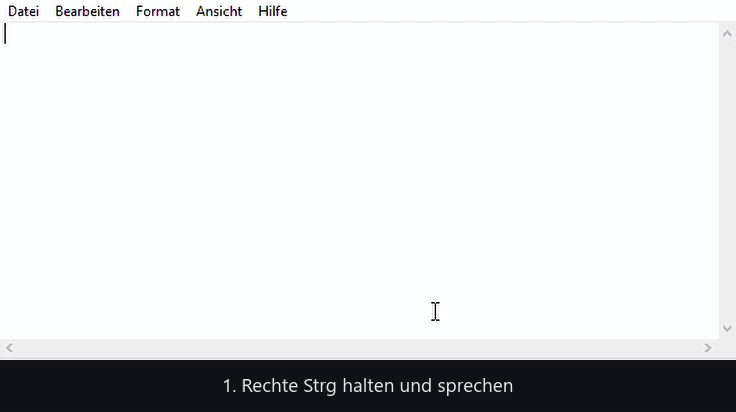

# my-local-whisper

**Dictation on Windows that never leaves your machine.** Hold a key, speak, release — the cleaned-up text appears at your cursor or on your clipboard. Speech recognition and text clean-up both run locally on your own GPU.

It dictates, it cleans up, and it translates: **English and German are equally at home**, and Spanish, Italian and Russian come out of the translation mode. Nothing here is an English-only afterthought — it runs Whisper `large-v3-turbo` rather than a small English model, keeps your own vocabulary file, and umlauts stay umlauts, so German comes out as well as English does.

*Deutsche Fassung weiter unten ↓*



*Real recording, nothing sped up: hold the key, speak, release — about five seconds later the cleaned-up text is in the editor. [Same demo as a 50-second video with sound](docs/demo.mp4), including English, German and technical terms.*

---

## What it does

- **Hold to talk** (default: right Ctrl), or **toggle mode** for long stretches — press once to start, press again to stop.
- **Recording starts the instant you press.** The microphone stream stays open, and a 0.6 second pre-roll keeps what you said just before the key went down — no more swallowed first word. The badge only turns red once audio really arrives, so what you see is what is being recorded.
- **Up to 60 minutes in one go.** Transcription runs while you are still speaking, cut at pauses. After you stop you wait about 5 seconds, whether you spoke for 10 seconds or 20 minutes.
- **Clean-up, not answers.** A small local language model removes filler words, adds punctuation and applies spoken self-corrections ("make that seventy-five" after "fifty"). It never answers your text — a dictated question stays a question.
- **It stays faithful to what you said.** Clean-up models like to be helpful, and helpful is wrong here: ours once turned "seventy-five" into "75k". A guard checks the result afterwards — every digit must have been spoken, addresses and URLs must survive unchanged, nothing may be dropped wholesale. If a rule trips, you get the raw transcript instead of a polished lie.
- **Appending.** Dictate again within a minute of a dictation that only went to the clipboard, and the new text is appended to it. One Ctrl+V brings both. Never after an automatic paste.
- **Translation mode.** Tray menu → "Translate into" (English, German, Spanish, Italian, Russian). Dictate in your language, get the other one out. Off after every start, so normal dictation is never a surprise.
- **Your own vocabulary, in two tiers.** Terms in `dictionary.txt`, misheard spellings in `aliases.txt`. With `--calibrate` you read your terms out loud once and confirm what Whisper makes of them. Whisper's prompt only holds about 224 tokens and silently drops the tail of a longer list, so everything below the `# === NUR-CLEANUP` marker line goes to the clean-up model only. The app prints the size of each tier at startup.
- **Pasting that stays out of the way.** If a text field has focus, the text is pasted directly; otherwise it waits on the clipboard until you press Ctrl+V wherever you want it.
- **A badge at the mouse pointer** showing recording time, progress and the result. Click-through, never steals focus.
- **It speaks your language.** The interface — tray menu, notifications, the badge — ships in English, German, Russian, Spanish and Italian. On the first start it follows your Windows display language, so it is already in your language when you install it, and you can switch it any time under *Language* in the tray. Adding another one is a single block in [`wf/i18n.py`](wf/i18n.py); the self-test then checks that no line is missing.
- **Your last dictations are one click away.** Every delivered text is also written to a local log; the tray menu opens it, so a text you lost from the clipboard is never gone. The log is kept for 14 days by default and never leaves the machine.

## What it does not do

- **Windows only.** Pasting and window detection use Windows APIs (UI Automation, SendInput).
- **It is not faster than the cloud services.** The gain is privacy, accuracy in the language you actually speak, and zero running cost — not speed. On an RTX 2080 Super, a 13-second dictation takes about 2.3 seconds.
- **Without an NVIDIA GPU** it falls back to the CPU and gets noticeably slower. A smaller model (`stt.model: "small"`) helps and costs accuracy.
- **No support promise.** This was built for one person's own use and is shared because it may be useful to others. Issues and pull requests are welcome; answers may take a while.

## Requirements

- Windows 10 or 11
- Python 3.11 or newer
- [Ollama](https://ollama.com) with a small model for the clean-up: `ollama pull qwen2.5:3b-instruct`
- Recommended: an NVIDIA GPU with at least 6 GB of memory (`large-v3-turbo` uses about 1.6 GB, the language model about 2.1 GB)

## Install

```
git clone https://github.com/escape-universe/my-local-whisper.git
cd my-local-whisper
py -m pip install -r requirements.txt
ollama pull qwen2.5:3b-instruct
py whisperflow.py
```

On the first run Whisper downloads its model (once, about 1.5 GB). After that a tray icon sits in the notification area: blue means ready.

**Start it automatically:** register `start-whisperflow-silent.vbs` as a logon task in Task Scheduler — **without** administrator rights, otherwise Windows blocks pasting into ordinary applications.

## Using it

| Action | What happens |
|---|---|
| Hold right Ctrl, speak, release | Text is transcribed, cleaned up and delivered |
| Double beep | Text was pasted directly |
| Single beep | Text is on the clipboard, Ctrl+V pastes it |
| Low beep | Something failed, details are in the tray note |
| Release and immediately press again | Start over (short recordings are dropped, long ones are still delivered) |
| Dictate again within a minute | Appended to the previous text if that one is still on the clipboard |
| Right-click the tray icon | Toggle mode, translation target, interface language, copy last text, open the log, quit |

## Configuration

Everything is documented in [`config.yaml`](config.yaml): key, microphone, model, language-model endpoint, paste method, on-screen badge. Restart after changing it.

The language model does not have to run on the same machine — any OpenAI-compatible endpoint on your own network works, for example a `llama.cpp` server on a stronger box (`llm.base_url`).

One thing worth knowing: use **`127.0.0.1`, not `localhost`**. On Windows, `localhost` tries IPv6 first and runs into a timeout, which costs about 2 seconds per clean-up.

## Checking that it works

```
py whisperflow.py --selftest      # deterministic tests, no microphone needed
py whisperflow.py --list-devices  # list microphones
py manual_inject_test.py          # test pasting live (opens Notepad)
py whisperflow.py --calibrate     # tune the vocabulary with your own voice
py whisperflow.py --clean-text "um so the budget more like seventy five"   # clean-up stage only
```

Or double-click `testen-konsole.bat`: that runs the app with a visible console, so every dictation shows you the raw transcript, the cleaned text, the timings and whether a faithfulness rule tripped. `kalibrieren.bat` does the same for calibration.

## Privacy

Audio stays in memory and is discarded after processing — nothing is recorded to disk. The delivered text is appended to `data/history.log` for 14 days so you can get it back; set `ui.history_file: null` to switch that off. There are exactly two outbound connections: the one-time model download on first run, and the call to the language model at the address you set in `config.yaml`. With `127.0.0.1` there, no byte leaves the machine.

## Language of the source

The interface comes in five languages (see above); the configuration file and this README are English. **Comments and docstrings inside the code are still German**, as are the labels of the self-test and the console output — this started as a personal tool. That is on the list; it does not affect how the program behaves.

## Licence

MIT — see [LICENSE](LICENSE). Free to use, change and pass on, without warranty.

Built at [Escape Universe](https://escapeuniverse.de), Nienburg / Hannover / Leipzig.

---

# my-local-whisper (deutsch)

**Diktieren unter Windows, ohne dass etwas den Rechner verlässt.** Taste halten, sprechen, loslassen — der bereinigte Text landet am Cursor oder in der Zwischenablage. Spracherkennung und Textbereinigung laufen lokal auf deiner Grafikkarte.

Es diktiert, räumt auf und übersetzt: **Deutsch und Englisch sind gleichermaßen zu Hause**, dazu Spanisch, Italienisch und Russisch im Übersetzungsmodus. Deutsch ist dabei kein Anhängsel: Whisper `large-v3-turbo` statt eines englischen Kleinmodells, eigenes Wörterbuch für Namen und Fachbegriffe, Umlaute bleiben Umlaute.



*Echte Aufnahme, nichts beschleunigt: Taste halten, sprechen, loslassen — rund fünf Sekunden später steht der bereinigte Text im Editor. [Dieselbe Demo als 50-Sekunden-Video mit Ton](docs/demo.mp4).*

### Was es kann

- **Halten und sprechen** (Standard: rechte Strg-Taste) oder **Umschalt-Modus** für lange Reden: einmal drücken an, nochmal drücken aus.
- **Bis 60 Minuten am Stück.** Die Transkription läuft schon während du sprichst, geschnitten an Sprechpausen. Nach dem Stoppen wartest du rund 5 Sekunden, egal ob du 10 Sekunden oder 20 Minuten geredet hast.
- **Aufnahme startet sofort beim Drücken.** Das Mikrofon bleibt bereit, 0,6 Sekunden Vorlauf fangen ab, was knapp vor dem Tastendruck gesagt wurde. Kein verschlucktes erstes Wort mehr. Das rote Feld erscheint erst, wenn wirklich Ton ankommt.
- **Aufräumen statt Antworten.** Ein kleines lokales Sprachmodell entfernt Füllwörter, setzt Satzzeichen und wendet gesprochene Selbstkorrekturen an. Es beantwortet deinen Text nicht: eine diktierte Frage bleibt eine Frage.
- **Treue zum Gesagten.** Aufräum-Modelle wollen gefallen, und genau das ist hier falsch: unseres machte aus „fünfundsiebzig" einmal „75k". Ein Wächter prüft das Ergebnis danach. Jede Ziffer muss gesagt worden sein, Adressen bleiben unverändert, nichts darf einfach wegfallen. Greift eine Regel, bekommst du den Rohtext statt einer geglätteten Behauptung.
- **Anhängen.** Diktierst du innerhalb einer Minute erneut, während der letzte Text noch in der Zwischenablage liegt, wird angehängt. Ein Strg+V bringt beides. Nie nach automatischem Einfügen.
- **Übersetzen.** Tray-Menü → „Übersetzen nach" (Englisch, Deutsch, Spanisch, Italienisch, Russisch). Nach jedem Start wieder aus.
- **Eigenes Vokabular in zwei Stufen.** Begriffe in `dictionary.txt`, Hörfehler in `aliases.txt`, Feinschliff mit `--calibrate`. Whispers Prompt fasst nur rund 224 Tokens und lässt den Rest einer längeren Liste stillschweigend weg, deshalb geht alles unterhalb der Markerzeile `# === NUR-CLEANUP` nur noch ans Aufräum-Modell.
- **Einfügen, das nicht stört.** Textfeld im Fokus: wird direkt eingefügt. Sonst liegt der Text in der Zwischenablage und du drückst Strg+V, wo du willst.
- **Spricht deine Sprache.** Die Oberfläche — Tray-Menü, Meldungen, Anzeigefeld — gibt es auf Englisch, Deutsch, Russisch, Spanisch und Italienisch. Beim ersten Start richtet sie sich nach der Windows-Anzeigesprache, ist also sofort richtig, und im Tray unter *Sprache* jederzeit umstellbar. Eine weitere Sprache ist ein Block in [`wf/i18n.py`](wf/i18n.py), der Selbsttest prüft dann auf Vollständigkeit.
- **Die letzten Diktate ein Klick entfernt.** Jeder gelieferte Text landet zusätzlich in einer lokalen Log-Datei, das Tray-Menü öffnet sie. Was aus der Zwischenablage verschwunden ist, ist damit nicht weg. Standard: 14 Tage, verlässt den Rechner nie.

### Was es nicht kann

Nur Windows. Nicht schneller als die Cloud-Dienste (der Gewinn ist Datenschutz, Genauigkeit in deiner Sprache und null laufende Kosten). Ohne NVIDIA-Grafikkarte deutlich langsamer. Kein Support-Versprechen.

### Installation

```
git clone https://github.com/escape-universe/my-local-whisper.git
cd my-local-whisper
py -m pip install -r requirements.txt
ollama pull qwen2.5:3b-instruct
py whisperflow.py
```

Voraussetzungen: Windows 10/11, Python 3.11+, [Ollama](https://ollama.com), empfohlen eine NVIDIA-Karte mit mindestens 6 GB Speicher. Beim ersten Start lädt Whisper einmalig rund 1,5 GB. Danach liegt unten rechts ein Tray-Icon, blau heißt bereit.

**Automatisch starten:** `start-whisperflow-silent.vbs` in der Aufgabenplanung als Anmelde-Aufgabe eintragen, **ohne** Administratorrechte — sonst blockiert Windows das Einfügen in normale Programme.

### Einstellungen

Alles kommentiert in [`config.yaml`](config.yaml) (auf Englisch). Wichtig: als Adresse für das Sprachmodell **`127.0.0.1` statt `localhost`** eintragen, sonst kostet ein IPv6-Timeout rund 2 Sekunden pro Diktat.

Zum Ausprobieren: **`testen-konsole.bat`** startet das Programm mit sichtbarer Konsole und zeigt zu jedem Diktat Rohtext, bereinigten Text, Zeiten und ob ein Treue-Wächter angesprungen ist. **`kalibrieren.bat`** macht dasselbe für die Kalibrierung mit der eigenen Stimme.

### Datenschutz

Audio bleibt im Arbeitsspeicher und wird danach verworfen, es wird nichts aufgezeichnet. Der gelieferte Text steht 14 Tage lokal in `data/history.log` (abschaltbar mit `ui.history_file: null`). Ausgehende Verbindungen gibt es zwei: der einmalige Modell-Download und der Aufruf des Sprachmodells unter der Adresse aus `config.yaml`. Steht dort `127.0.0.1`, verlässt kein Byte den Rechner.

### Sprache im Quelltext

Die Oberfläche gibt es in fünf Sprachen (siehe oben), Konfiguration und diese Datei sind englisch. **Die Kommentare im Code sind noch deutsch**, ebenso die Beschriftungen der Selbsttests — das Werkzeug ist als persönliches Projekt entstanden. Steht auf der Liste, ändert am Verhalten nichts.

### Lizenz

MIT, siehe [LICENSE](LICENSE). Entstanden bei [Escape Universe](https://escapeuniverse.de) in Nienburg, Hannover und Leipzig.
